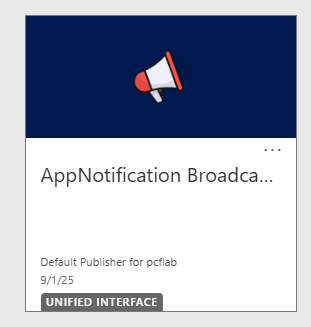

# 🔔 dataverse-broadcast-notification-solution 📢
Open source Dataverse Solution to display Global Notifications per Model-Driven Apps
Helpful to notify your dataverse end users.

## ⭐Key Features⭐
✔️ Enable PowerPlatform Admins/Super Users to broadcast global notifications **per app** to their end users \
- The app is only localized in english and french.

✔️ Provide a dedicated model-driven app "*AppNotification Broadcasts Management*" to manage your global notifications \
✔️ Provides two security roles :
- one for admin/super users: `App Global Notification - Manager`
- one for end users: `App Global Notification - Reader` 

✔️ 100% supported code \
✔️ Notifications's content can be localized in english and french.

## 🎯 Most popular use cases 📂
-  Notify users system will shutdown for maintenance  🚧
-  Any kind of announcements 📣
-  Warn/inform users of a known bug ⚠️🐞

## Getting Started
 
### 1. Import Solution
1. Simply download the latest [release](https://github.com/dotnetprog/dataverse-broadcast-notification-solution/releases/latest)

2. Import the Managed or Unmanaged solution to your dataverse environment

### 2. Setup security roles

The solution provides two security roles:
- App Global Notification - Manager
  - Allow users to create/edit/delete global notifications
  - Allow acces to the model-driven app: *AppNotification Broadcasts Management*
- App Global Notification - Reader
  - This role gives only the read privilege to global notifications, required to display notifications
  - Does not give access to the model-driven app: *AppNotification Broadcasts Management*

If you want to use your own security roles:

- Make sure your end-users have atleast **read organization level privilege** on the following entities:
  - fdn_BroadcastAppNotification
  - fdn_LocalizedNotificationContent
- Make sure your admin users have atleast **create,write and read organization level privileges** on the following entities:
  - fdn_BroadcastAppNotification
  - fdn_LocalizedNotificationContent

### 3. Configure your global notifications

1. Navigate to the model-driven app: *AppNotification Broadcasts Management* 
2. Create a new global notification \

3. Fill the mandatory fields and save
4. Translate your notification message if needed. \

5. Publish the notification \

> **Note :** Notifications must be published to be visible by your end users.

## Important ❗ What you need to know ❗

- Notifications can take up to **5 minutes** to be visible by your end-users. For performance purposes, the query result is cached for 5 minutes until it queries again.
  - Currently, the cache time is hardcoded. This will be configurable in a futur release.
- Notifications are displayed when user:
  - loads a form record
  - loads a 'entitylist' page
- Only Notifications that are bound the current model driven app that the end user is on will show up.
- Only **Published** notifications are displayed.
- Notifications can be unpublished the same way you publish them.
- As of now, users are not able to 'dissmiss' notifications as there was no supported way to save that state.
- The global notifications works around the [Xrm.App](https://learn.microsoft.com/en-us/power-apps/developer/model-driven-apps/clientapi/reference/xrm-app) Client-Api
- The notification mechanism uses the application ribbon to display the notifications. There is a hidden button with a custom enable rule that it's sole purpose is to render the notifications to the ui.

## Notification Samples

### Information

### Warning

### Danger

### Success

### When more than one notification (closed)

### When more than one notification (opened)

## Feel free to contribute or submit ideas/suggestions/issues

This is an open-source solution. Therefore the community is more than welcomed to contribute to this project.
Ideas and suggestions are also welcomed so I can add more features for the community.

If you have any bugs, please submit an issue.

